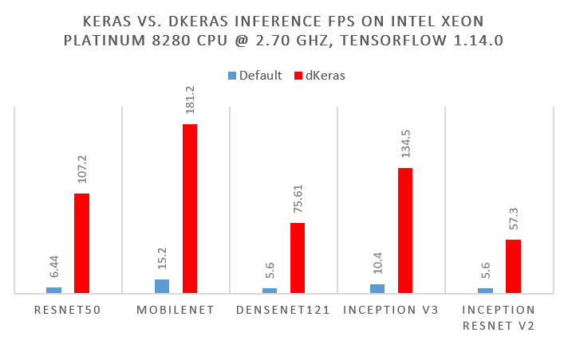

.. dkeras documentation master file, created by
   sphinx-quickstart on Mon Aug 19 18:32:03 2019.
   You can adapt this file completely to your liking, but it should at least
   contain the root `toctree` directive.

dKeras: Distributed Keras Engine
################################

**Make Keras faster with only one line of code.**
-------------------------------------------------

dKeras is a distributed Keras engine that is built on top of
`Ray <https://github.com/ray-project/ray/>`_. By wrapping dKeras around your
original Keras model, it allows you to use many distributed deep learning
techniques to automatically improve your system's performance.

With an easy-to-use API and a backend framework that can be deployed from
the laptop to the data center, dKeras simpilifies what used to be a complex
and time-consuming process into only a few adjustments.

Why Use dKeras?
---------------

Distributed deep learning can be essential for production systems where you
need fast inference but don't want expensive hardware accelerators or when
researchers need to train large models made up of distributable parts.

This becomes a challenge for developers because they'll need expertise in not
only deep learning but also distributed systems. A production team might also
need a machine learning optimization engineer to use neural network
optimizers in terms of precision changes, layer fusing, or other techniques.

Distributed inference is a simple way to get better inference FPS. The graph
below shows how non-optimized, out-of-box models from default frameworks can
be quickly sped up through data parallelism:

.. toctree::
   :maxdepth: 6
   :caption: About dKeras

   why

   install

   design

   getting_started

.. toctree::
   :maxdepth: 6
   :caption: The dKeras API

   dkeras_api

   data_server

   worker

   development_tips

.. toctree::
   :maxdepth: 6
   :caption: Examples

   basic

   multi_model

.. toctree::
   :maxdepth: 6
   :caption: Help

   troubleshooting

   profiling

   contact

